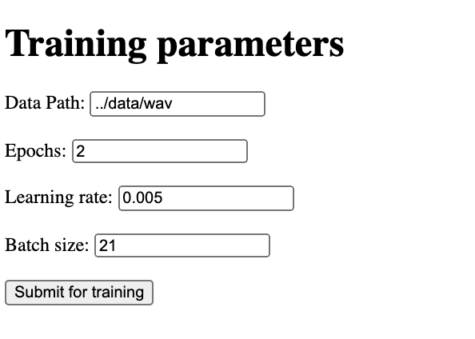
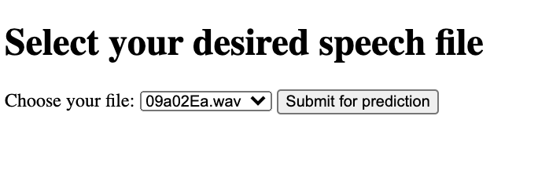

# Report Visium - speech emotion detection from the Emo-DB


This project's goal was to recognize the emotions from different speech files coming from the Emo-DB dataset.

The data is processed, trained and the resulting model is evaluated in this project.

## Launch the project

The project is put inside of a docker container. One output of this container is a jupyter notebook containing the whole process (from cleaning to training and evaluating the data) and a Flask API for training and evaluating the model.

To deploy the container, do (you must be in the same directory as the makefile):

``` make install```

In case this does not work (for whatever reason), just do the following:

```docker build -t container_max .```

```docker run -p 5000:5000 -p 8888:8888 --gpus all container_max```
___
## Access the notebook

To access the jupyter notebook, go to your usual navigator and type:

[```http://localhost:8888/ ```](http://localhost:8888/ )

The password is **visium**
__
## Access the flask endpoints

To access the Flask api, go to:

[```http://localhost:5000```](http://localhost:5000 )


There should be two links:
- Training link :
    [```http://localhost:5000/train_model```](http://localhost:5000/train_model )
    It **needs** to be run before the evl step. You will be able to set your parameters for the training within this window. Click on submit to train. **(A recommended number of 200 EPOCHS is necessary for great results)**.

    The first run takes some time since it first need to process the dataset.

    

    From there, you can set the learning rate, batch size, file path  (which should not really be changed after some reflection) and epochs.

    For a fast result, I left 2 epochs in the training parameters. To have good results, try with a higher number of epochs. I recommend 200 epochs.

    Please adjust the batch size depending on your hardware for better results/loadability of the model (A batch size of 32 correspond to 8Gb on a 3070RTX).


- Eval link :
    [```http://localhost:5000/eval```](http://localhost:5000/eval )
    
    You will only be able to process your desired file if you have already trained a model beforehand. Once it is done, the latest trained model will be used.


    

    Once you trained a model, select your desired file from the drop-down list and click on submit.

**Disclaimer:**
It is my very first project with flask hence, my coding practice for this package are not yet top notch.
